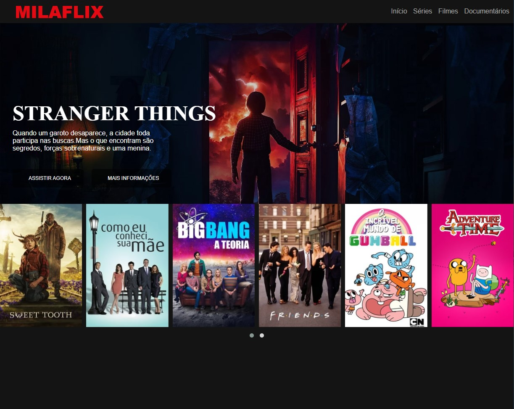

# Clone_pagina_netflix

Olá, pessoal! Este projeto representa meu desafio de personalizar a página da Netflix e adaptá-la ao meu estilo, agora batizada de "Milaflix". 
A proposta inclui a criação de um menu para listar as séries que já assisti! 💟

Repliquei a página da Netflix de maneira responsiva, indo além do conteúdo ensinado. 
Algumas funcionalidades adicionadas incluem um ícone de pesquisa e um destaque com zoom ao passar o cursor sobre o menu de séries.

## Tool kit
- ``HTML:`` Responsável pela estruturação da página.
- ``CSS:`` Aplicado para estilizar e dar design ao layout.
- ``Flexbox:`` Adotado para criar um design responsivo e flexível.
- ``JavaScript:`` Incorporado para aprimorar a interatividade e funcionalidades.
- ``VS Code IDEA:`` O ambiente de desenvolvimento integrado que proporcionou uma codificação eficiente.

Obrigada pela visita! 🍿
